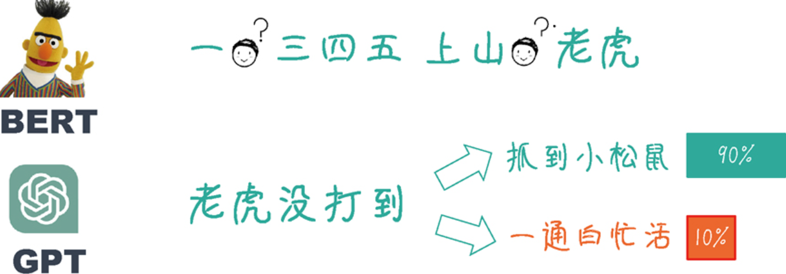

# Natural Language Processing

## Chapter1

- AGI
- 过拟合
- 马尔可夫假设

- N-Gram
- Bag-of-Words
  - 独热编码(One-Hot Encoding)中的词汇鸿沟问题（词汇歧义、同义词等）​。
- 分布式表示(Distributed Representation)是一种将词或短语表示为数值向量的方法

- 神经网络
  - CNN、RNN、LSTM

- Word2Vec(W2V)

Word2Vec(W2V) 是一种通过训练神经网络模型来学习词汇的分布式表示，简单而又高效。Word2Vec有两种主要的架构：连续词袋(Continuous Bag of Words, CBOW)模型和Skip-Gram模型

CBOW 模型通过预测单词上下文（周围词）的目标单词来学习词向量，而Skip-Gram模型则通过预测目标单词周围的单词来学习词向量。

- Transformer

- SFT(Supervised Fine-Tuning) 监督微调
- RL(Reinforcement Learning) 强化学习
- 预训练模型 + 微调大模型 
- 无监督学习

- **零样本学习**

零样本学习（Zero-Shot Learning）是指在训练过程中完全没有见过目标任务的任何标签数据，仅依靠预训练阶段学到的通用知识，直接对新任务生成输出。其核心挑战在于模型必须理解任务描述并在没有示例的情况下给出正确答案。

与传统方法的区别​​
1. ​​微调（Fine-tuning）​​：需要在目标任务的标注数据上进行反向传播和参数更新；而零样本学习跳过这一步，模型保持固定，仅通过提示（prompt）获得任务指令即可完成推理。
2. ​​少样本学习（Few-Shot Learning）​​：给模型提供少量示例，让它在上下文中模仿；零样本则连示例也不提供，完全依赖模型内部知识

​​- 少样本学习（Few-Shot Learning）

模型提供少量示例，让它在上下文中模仿；零样本则连示例也不提供，完全依赖模型内部知识

- Prompt 模式/ Instruct 模式

Prompt模式和Instruct模式都基于这样一种思想：在训练阶段，这些模型通过学习大量的文本数据，掌握了语言的结构、语法和一定程度的语义知识。那么，在应用阶段，通过在输入中提供恰当的信息和指导，可以引导大型预训练模型（如GPT-3）生成相关性更强且更有用的输出。这种方法可以看作与模型进行一种“对话”​，用户提供输入（Prompt或Instruct）​，然后模型根据输入生成相应的输出。

- BERT vs GPT

BERT的预训练过程就像是做填空题。在这个过程中，模型通过大量的文本数据来学习，随机地遮住一些单词（或者说“挖空”​）​，然后尝试根据上下文来预测被遮住的单词是什么（这是双向的学习）​。这样，模型学会了理解句子结构、语法及词汇之间的联系。

GPT的预训练过程则类似于做文字接龙游戏。在这个过程中，模型同样通过大量的文本数据来学习，但是它需要预测给定上文的下一个单词（这是单向的学习）​。

二者相比较，GPT更接近语言模型的本质，因为它的预训练过程紧凑且有效地再现了自然语言生成的过程。GPT 正是通过从左到右逐个预测单词，使得模型在生成过程中能够学习到自然语言中的连贯表达、句法和语义信息。

涌现能力(Emergent Capabilities)

在大型预训练模型的发展过程中，研究人员发现随着模型参数数量的增加和训练语料库的扩充，大模型逐渐展现出一系列新的能力。这些能力并非通过显式编程引入的，而是在训练过程中自然地呈现出来的。研究人员将这种大模型逐步展示出新能力的现象称为“涌现能力”(Emergent Capabilities)。

多模态输入
大模型的能够理解图像，能够接受图像和文本输入，也就是多模态输入，输出正确的文本回复