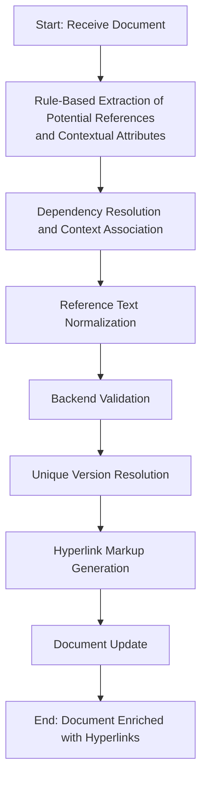

# Hyperlink Recognition in Legal Documents

Focus: identifying references to laws, statutes, and case numbers in legal documents.

## Context

Legal documents frequently reference other laws, regulations, cases, or clauses. These references can appear in multiple forms:

- Titles enclosed in `《》, “”`
- Keywords or predefined terms
- Common Abbreviations (short names)
- Case numbers

Currently, these references exist as plain text, requiring manual lookup and interpretation. This leads to several issues:

- Users cannot quickly navigate to the referenced law or case.
- References may be ambiguous or outdated.
- Manual verification and linking are time-consuming and error-prone.

**Objective**: Build an automated Hyperlink Recognition system that detects references, validates their correctness, and converts them into interactive hyperlinks while ensuring accuracy and uniqueness.


## High-Level Workflow

1. Rule-Based Extraction of Potential References and Contextual Attributes

    - Scan the document for potential references (titles, case numbers, abbreviations, statutes, etc.)
    - Extract associated contextual attributes, including promulgators, issue numbers, and issue dates.

2. Dependency Resolution and Context Association

    - Process dependencies between references.
    - For example, abbreviations defined within the document cannot exist independently; they must be linked to the original law reference.
    - Associate references with relevant contextual attributes to aid validation and disambiguation.

3. Reference Text Normalization

    - Clean and standardize the reference text.
    - Remove optional prefixes, suffixes, or extraneous information while preserving the essential core of the reference.

4. Backend Validation

    - Query the validation service to verify the existence and correctness of each reference.

5. Unique Version Resolution

    - Determine a unique version for each reference using techniques such as prefix/suffix matching and leveraging contextual attributes (e.g., promulgators, issue number, issue date.).

6. Hyperlink Markup Generation

    - Convert validated references into functional hyperlinks within the document while preserving its original format.

7. Document Update

    - Send the enriched document to the backend storage service for update.
    - The backend automatically handles persistence, versioning, and metadata management.




## Rule-Based Entity Extraction Engine

**Purpose**: Automatically extract potential references in legal documents and extract relevant contextual attributes to support hyperlink recognition.

> [!Tip] Internally, both references and reference attributes are treated uniformly as entities, because they are all extracted from text based on configurable rules. Using a generic Entity structure allows for a unified representation and simplifies processing, while still preserving metadata for later validation and linking.

- **Input**: a paragraph of text (smallest semantic unit)
- **Output**: a list of potential references with metadata, e.g.:

```json
[
    {
        "text": "Criminal Law",
        "start": 0,
        "end": 11,
        "category": "Reference",
        "entity_type": "Abbreviation/Title/CaseNo",
        "attrs": []
    }
]
```

**Entity Definition**

```python
@dataclass
class Entity:
    text: str # Extracted text span
    start: int # Inclusive start index
    end: int # Exclusive end index
    category: str # "Reference" or "Attr"
    entity_type: str # Specific type, e.g., "Title", "CaseNo", "Abbreviation"
    attrs: list[str] | None = None # Optional list of contextual attributes
```

**Base Extractor Interface**

```python
class Extractor(ABC):
    """Abstract base class for entity extractors."""

    @abstractmethod
    def extract(self, paragraph: str) -> Iterable[Entity]:
        """
        Extract entities from a text paragraph.

        Params:
            paragraph: The text to process.

        Returns:
            An iterable of Entity objects containing extracted spans and metadata.
        """
        raise NotImplementedError
```

### Supported Extraction Rules

- **Symbol-based Extraction**: Extract references enclosed in special paired symbols (e.g., 《...》).

- **Keyword-based Extraction**: Extract references using a predefined list of keywords. Any occurrence of these keywords is treated as a potential reference.

- **Dynamic keyword Extraction**: Extract keywords defined within the document itself. The keyword list is dynamically updated, and subsequent text is scanned again based on the updated list. For example, abbreviations defined in the document are treated as potential references.

- **Regex-Based Extraction**: Use fixed patterns to extract structured references and their attributes- such as case numbers, article numbers, issue numbers, and dates.

**Rule Application by Scenario**

| scenarios      | type      | Detection Rule               |
| -------------- | --------- | ---------------------------- |
| Law Title      | Reference | Symbol & Keyword extraction |
| Case Number    | Reference | Regex extraction            |
| Abbreviation   | Reference | Dynamic keyword extraction  |
| Article Number | Reference | Regex extraction            |
| Issue Number   | Attr      | Regex extraction            |
| Issue Date     | Attr      | Regex extraction            |
| Promulgator    | Attr      | Keyword extraction          |


### Symbol-based Extraction

Detect text enclosed within paired symbols (e.g., 《...》) in a given text, with support for configurable handling of nested symbols:

  - Outermost only: keep the widest enclosing pair and ignore inner ones.
  - Innermost only: keep the deepest enclosed pair and ignore outer ones.


```python
NestingStrategy = Literal["outermost", "innermost", "all"]

class SymbolBasedExtractor(Extractor):
    def __init__(self, strategy: NestingStrategy = "all"):
        """
        :param strategy: defines how to handle nested paired symbols
                         "outermost": keep only the widest enclosing pair
                         "innermost": keep only the deepest enclosed pair
                         "all": keep all matched pairs (default)
        """
        self.strategy = strategy

    def extract(self, paragraph: str) -> Iterable[Entity]:
        """
        Extract text enclosed in paired symbols (e.g., 《...》) as entities.
        Handles nested symbols based on the configured strategy.
        """
        ...
```