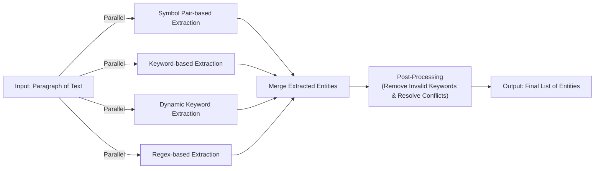
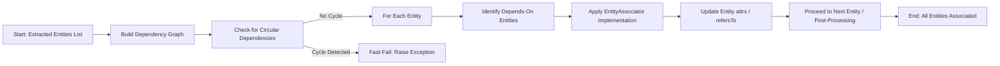

# Hyperlink Recognition in Legal Documents

Focus: identifying references to laws, statutes, and case numbers in legal documents.

## Context

Legal documents frequently reference other laws, regulations, cases, or clauses. These references can appear in multiple forms:

- Titles enclosed in `《》, “”`
- Keywords or predefined terms
- Common Abbreviations (short names)
- Case numbers

Currently, these references exist as plain text, requiring manual lookup and interpretation. This leads to several issues:

- Users cannot quickly navigate to the referenced law or case.
- References may be ambiguous or outdated.
- Manual verification and linking are time-consuming and error-prone.

**Objective**: Build an automated Hyperlink Recognition system that detects references, validates their correctness, and converts them into interactive hyperlinks while ensuring accuracy and uniqueness.


## High-Level Workflow

1. Retrieve the document from DataLake
   - Triggered by the SQS event.
   - Retrieve only the text nodes may contain entities requiring enrichment from DataLake, based on the event metadata, instead of fetching the entire document.

2. Rule-Based Extraction of Potential References and relevant Contextual Attributes

   - Scan the document for potential references (titles, case numbers, abbreviations, statutes, etc.)
   - Extract associated contextual attributes, including promulgators, issue numbers, and issue dates.

3. Dependency Resolution and Context Association

   - Process dependencies between references.
   - For example, abbreviations defined within the document cannot exist independently; they must be linked to the original law reference.
   - Associate references with relevant contextual attributes to aid validation and disambiguation.

4. Reference Text Normalization

   - Clean and standardize the reference text.
   - Remove optional prefixes, suffixes, or extraneous information while preserving the essential core of the reference.

5. Backend Validation

   - Query the validation service to verify the existence and correctness of each reference.

6. Unique Version Resolution

   - Determine a unique version for each reference using techniques such as prefix/suffix matching and leveraging contextual attributes (e.g., promulgators, issue number, issue date.).

7. Hyperlink Markup Generation

   - Convert validated references into functional hyperlinks within the document while preserving its original format.

8. Document Update

   - Send back only enriched text nodes where entities were recognized.
   - The backend automatically handles persistence, versioning, and metadata management.


### Future Improvements / Advanced Extraction (MCP / LLM)


## Rule-Based Entity Extraction Engine

**Purpose**: Automatically extract potential references in legal documents and extract relevant contextual attributes to support hyperlink recognition.

> [!Tip] Internally, both references and reference attributes are treated as entities, extracted from text using configurable rules. Using a generic Entity structure allows unified processing while preserving metadata for later validation and linking.

- **Input**: a paragraph of text (smallest semantic unit)
- **Output**: a list of potential entity with metadata.

```json
[
    {
        "text": "Criminal Law",
        "start": 0,
        "end": 11,
        "category": "Reference",
        "entity_type": "Abbreviation/Title/CaseNo",
        "attrs": []
    }
]
```

**Entity Definition**

```python
@dataclass
class Entity:
    text: str # Extracted text span
    start: int # Inclusive start index
    end: int # Exclusive end index
    category: str # "Reference" or "Attr"
    entity_type: str # Specific type, e.g., "Title", "CaseNo", "Abbreviation"
    attrs: list[str] | None = None # Optional list of contextual attributes
```

**Base Extractor Interface**

```python
class Extractor(ABC):
    """Abstract base class for entity extractors."""

    @abstractmethod
    def extract(self, paragraph: str) -> Iterable[Entity]:
        """
        Extract entities from a text paragraph.

        :param paragraph: The text to process.
        :returns An iterable of Entity objects containing extracted spans and metadata.
        """
        raise NotImplementedError
```

### Supported Extraction Rules

- **Symbol Pair-based Extraction**: Extract entities enclosed within special paired symbols (e.g., 《...》).
- **Keyword-based Extraction**: Extract entities using a predefined list of keywords.
- **Dynamic keyword Extraction**: Extract entities defined dynamically in the document (e.g., abbreviations). The keyword list is dynamically updated, and subsequent text is scanned again based on the updated list.
- **Regex-Based Extraction**: Extract structured entities such as case numbers, article numbers, issue numbers, and dates.


#### Symbol Pair-based Extraction

Extract entities enclosed within special paired symbols (e.g., 《...》). 

This extractor is configurable with a set of symbol pairs, where each pair explicitly defines a left and right delimiter.

- Supports multiple symbol pairs (e.g., 《...》, (...), [...]).
- Handles nested symbols based on the configured nesting strategy:
  - **outermost**: keep only the widest enclosing pair.
  - **innermost**: keep only the deepest enclosed pair.
  - **all**: keep all matched pairs (default).

```python
NestingStrategy = Literal["outermost", "innermost", "all"]

class SymbolBasedExtractor(Extractor):
    def __init__(self, symbol_pairs: dict[str, str], strategy: NestingStrategy = "all"):
        """
        :param strategy: defines how to handle nested paired symbols
                         "outermost": keep only the widest enclosing pair
                         "innermost": keep only the deepest enclosed pair
                         "all": keep all matched pairs (default)
        """
        self.strategy = strategy

    def extract(self, paragraph: str) -> Iterable[Entity]:
        """
        Extract text enclosed in paired symbols (e.g., 《...》) as entities.
        Handles nested symbols based on the configured strategy.
        """
        ...
```

#### Keyword-based Extraction

Extract entities using a predefined list of keywords. Any occurrence of these keywords is treated as an entity. 

This extractor is suitable for identifying references such as law promulgators, commonly used legal terms, or fixed phrases.

- Configurable keyword list.
- Supports exact matching and optional case-insensitive matching.
- Handles overlapping keywords with strategies such as “longest match first”.
- ~~Exclusion of invalid keywords.~~
  - ~~Ignore matches that appear as a substring in a larger term that is not relevant.~~
    - ~~Example: If "公司法" is a keyword, but the text contains "外国公司法律法规", the match for "公司法" is ignored.~~

>[!tip] Note on Invalid Keywords
Exclusion of invalid keywords (e.g., “公司法” appearing inside “外国公司法律法规”) is not handled inside the extractor.
This filtering should be done as a post-processing step, comparing matched results with known invalid contexts or exclusion lists.

**Algorithm Implementation**

- Use a Trie (prefix tree) or Aho-Corasick multi-pattern matching algorithm to efficiently match multiple keywords at once. These methods naturally handle overlapping patterns and support longest-match priority.

- Alternatively, after generating all matches, apply a post-processing step:
  - Sort matches by length (longest first).
  - Iterate through matches in order of appearance.
  - Check for conflicts/overlaps and retain the longest valid match in each overlapping region.

```python
class KeywordBasedExtractor(Extractor):
    def __init__(self, keywords: list[str], case_sensitive: bool = False):
        """
        :param keywords: List of predefined keywords to match
        :param case_sensitive: Whether matching should be case-sensitive
        """
        self.keywords = keywords
        self.case_sensitive = case_sensitive
        self.fuzzy_threshold = fuzzy_threshold

    def extract(self, paragraph: str) -> Iterable[Entity]:
        """
        Extract entities by matching against predefined keywords.
        """
        # Implementation would scan paragraph for keyword matches
        # and return Entity objects with appropriate metadata
        ...
```

#### Dynamic keyword Extraction

Extract entities based on keywords defined within the document itself. This supports abbreviations or short forms introduced in the text. The keyword list is dynamically updated, and subsequent text is scanned again based on the updated list.

This extractor operates in multiple passes, first identifying potential keyword definitions within the document, then using those discovered keywords to find additional references throughout the text.

- Recognizes common patterns for defining abbreviations and terms(e.g., “简称为... / hereinafter referred to as …”).
- Dynamically updates the keyword list as the document is scanned.
- Handles temporal validity: keywords are only valid after being defined.
- Supports nested and overlapping keywords with priority rules.

**Algorithm Implementation**

- Step 1: Identify new keyword definitions
    - Use regex patterns (e.g., "简称为 xxx", "hereinafter referred to as xxx") to extract newly defined keywords.
    - Update the dynamic keyword dictionary with discovered definitions and their valid scope (temporal and/or paragraph range).

- Step 2: Multi-pattern keyword matching
    - Use a Trie (prefix tree) or Aho-Corasick algorithm to match multiple keywords efficiently.
    - Handles overlapping or nested keywords. Apply longest-match priority for conflict resolution.

- Step 3: Post-processing
    - Sort matches by length (longest first) and position.
    - Resolve overlaps by keeping the longest valid match in each region.

- Step 4: Temporal validity
    - Only consider keywords after they are defined; ignore occurrences before the definition.

```python
class DynamicKeywordExtractor(Extractor):
    def __init__(self, definition_patterns: list[str], default_keywords: list[str]):
        """
        :param definition_patterns: Regex patterns for identifying keyword definitions
        :param default_keywords: A list of pre-defined keywords to initialize the extractor
        """
        self.definition_patterns = definition_patterns
        self.dynamic_keywords = {**default_keywords}

    def extract(self, paragraph: str) -> Iterable[Entity]:
        """
        Extract entities using dynamically discovered keywords.
        Performs multiple passes to build and utilize the keyword dictionary.
        """
        # Pass 1: Identify new keyword definitions
        # Pass 2+: Use discovered keywords to find references
        # Return all discovered entities
        ...
```

#### Regex-Based Extraction

Use fixed patterns to extract structured entities such as case numbers, article numbers, issue numbers, and dates.

- Configurable regex patterns for different entity types.
- Captures matched text and optional named groups for contextual attributes.
- Can handle multiple patterns in a single pass.

```python
class RegexBasedExtractor(Extractor):
    def __init__(self, patterns: dict[str, str]):
        """
        :param patterns: Dictionary mapping entity types to regex patterns
        """
        self.patterns = {entity_type: re.compile(pattern) for entity_type, pattern in patterns.items()}

    def extract(self, paragraph: str) -> Iterable[Entity]:
        """
        Extract entities using predefined regex patterns.
        """
        # Apply each pattern to the paragraph
        ...
```


### Workflow

**Pipeline Overview**

- Input paragraph → all extractors applied in parallel
- Merge extracted entities
- Post-processing:
    - Remove invalid keywords
    - Resolve overlaps based on extractor priority and longest-match
- Output final list of entities



**Rule Application by Scenario**

| scenarios        | category  | Extraction Rule             | Priority |
| ---------------- | --------- | --------------------------- | -------- |
| Law Title        | Reference | Symbol & Keyword extraction | 1        |
| This Law (该法)  | Reference | Keyword extraction          | 1        |
| Hereof (本法)    | Reference | Keyword extraction          | 1        |
| Case Number      | Reference | Regex extraction            | 1        |
| Abbreviation     | Reference | Dynamic keyword extraction  | 2        |
| Article Number   | Reference | Regex extraction            | 3        |
| Issue Number     | Attr      | Regex extraction            | 3        |
| Issue Date       | Attr      | Regex extraction            | 3        |
| Promulgator      | Attr      | Keyword extraction          | 3        |
| Invalid Keywords | Other     | Keyword extraction          | -        |


### Post-processing

After running multiple extraction rules in parallel, the results go through a unified post-processing stage to ensure correctness and consistency.

#### Remove Invalid Keywords

Sometimes a keyword match is spurious because it occurs as a substring of a larger, irrelevant phrase. In such cases, the match should be excluded.

```
假设 “公司法” 是关键字，识别 “根据外国公司法律法规...”，会错误将该文本中的 “公司法” 识别为引用，设定一组排除关键字并识别，如果关键字与识别的排除关键字 overlap, 则忽略
```

- Rule: If a keyword overlaps with an exclusion keyword, ignore the match.
- Example:
  - Keyword: 公司法 ("Company Law")
  - Text: 根据外国公司法律法规... ("according to Foreign Company Law Regulations...")
  - Incorrect extraction: 公司法
  - Correct behavior: ignore this match because it appears inside a larger, irrelevant term.

#### Overlap Conflict Resolution

When multiple rules run in parallel, overlap conflicts may occur—two candidate entities share the same character span or one contains the other.

**Resolution Strategy**
  - Longest Match Priority: always prefer the longer span.
  - Entity Type Priority: Law Titles > Abbreviations

**Example: Abbreviation Overlap Case**

```
根据《中华人民共和国刑法》（以下简称为 “刑法”）和《2015年刑法修正案》（以下简称为 “2015刑法”），本案裁定如下。
```

Extraction Logic:

- Symbol Pair-based Extraction
  - 《中华人民共和国刑法》 → Law Title
  - 《2015年刑法修正案》→ Law Title

- Abbreviation Definition Extraction (Dynamic keyword extraction)
  - 简称为 “刑法” -> defines 刑法 -> Abbreviation
  - 简称为 “2015刑法” → defines 2015刑法 -> Abbreviation

- Overlap Handling
  - Conflict: 刑法 vs. 2015刑法 (substring overlap)
  - Correct resolution: keep the longer abbreviation (2015刑法) to avoid splitting it into 2015 + 刑法.

Final Extraction Output

```json
[
  {
    "text": "《中华人民共和国刑法》",
    "start": 2,
    "end": 16,
    "entity_type": "Title"
  },
  {
    "text": "《2015年刑法修正案》",
    "start": 21,
    "end": 48,
    "entity_type": "Title"
  },
  {
    "text": "刑法",
    "start": 52,
    "end": 65,
    "type": "Abbreviation",
  },
  {
    "text": "2015刑法",
    "start": 88,
    "end": 104,
    "type": "Abbreviation",
    // "refersTo": "《2015年刑法修正案》"
  }
]
```


## Dependency Resolution and Context Association

Entities extracted from the document may have dependencies or associations with other entities. For example, an Abbreviation depends on its corresponding Law Title, and an Article Number may depend on a Law Title or Abbreviation.


| Entity Type         | Category  | Depends On                                         | Description of Association Logic                                                            |
| ------------------- | --------- | -------------------------------------------------- | ------------------------------------------------------------------------------------------- |
| **Law Title**       | Reference | Issue Date,<br>Issue Number,<br>Promulgator        | Issue Date: lookbehind & lookahead,<br>Issue Number: lookahead,<br>Promulgator: lookbehind. |
| **This Law (该法)** | Reference | Law Title                                          | lookahead: find nearest following Law Title by entity index                                 |
| **Hereof (本法)**   | Reference | –                                                  | Implicit binding: associate with the primary Law Title of current document context          |
| **Case Number**     | Reference | –                                                  | –                                                                                           |
| **Abbreviation**    | Reference | Law Title                                          | lookahead: find nearest following Law Title by entity index                                 |
| **Article Number**  | Reference | Law Title,<br>This Law,<br>Hereof,<br>Abbreviation | lookahead: find nearest following reference by entity index                                 |
| **Issue Number**    | Attr      | –                                                  | –                                                                                           |
| **Issue Date**      | Attr      | –                                                  | –                                                                                           |
| **Promulgator**     | Attr      | –                                                  | –                                                                                           |


### EntityAssociator Interface

To handle these inter-entity relationships in a modular and extensible way, we introduce the EntityAssociator interface. Each entity type can have a specific implementation of EntityAssociator that defines how it resolves and associates with other dependent entities in the document.

```python
class EntityAssociator(ABC):
    """
    Interface for resolving and associating dependencies for a given entity.
    Each entity type can implement a specific associator that defines
    how it finds and links to related entities in the document.
    """

    @abstractmethod
    def associate(self, entity: Entity, depends_on_entities: Iterable[Entity]) -> None:
        """
        Associate the given entity with its dependent entities.

        :param entity: The entity whose dependencies are being resolved.
        :param depends_on_entities: A collection of entities that the current entity may depend on.
        :return: None. The entity's `attrs` or `refersTo` fields are updated in-place.
        """
        pass
```
  
  - Each entity type (e.g., Law Title, Abbreviation, Article Number) will have its own associator implementation.
  - The association logic (lookahead, lookbehind, regex, or custom rules) is encapsulated inside the implementation.

This design allows each entity type to encapsulate its own dependency resolution logic, making the pipeline more maintainable and extensible as new entity types or association rules are added.

**Data Structure Support**

In our use case, the most commonly used algorithm for entity association is lookahead/lookbehind based on entity index.

In Java, the built-in TreeMap is a natural fit for this requirement:

- Use the entity index as the key, and the entity itself as the value.
- Provides efficient nearest-neighbor lookup via floorEntry (lookbehind) and ceilingEntry (lookahead).
- Ensures log-time complexity (O(log n)) for insertions and queries.

In Python, however, there is no direct equivalent of TreeMap.
To achieve similar functionality, we implemented a NavigableDict/IndexedLookupDict, a lightweight navigation dictionary built on `bisect` and `UserDict`.

- Supports efficient nearest-neighbor lookup by entity index.
- Provides **read-only** guarantees to ensure consistent indexing during association.
- Offers methods similar to TreeMap (floor, ceiling, prev, next) to simplify association logic.

```python
class IndexedLookupDict(UserDict, Generic[T]):
    """
    A read-only navigable dictionary for index-based entity lookup.
    """
    
    def __setitem__(self, index: int, value: T) -> None:
        raise TypeError("Not support operation")

    def __delitem__(self, index: int) -> None:
        raise TypeError("Not support operation")

    def floor(self, index: int) -> T | None:
        """
        Returns the value associated with the greatest key <= the given key, or None if their so such key
        """
        pass
    def ceiling(self, index: int) -> T | None:
        """
        Returns the value associated with the smallest key >= the given key, or None if their so such key
        """
        pass
    def lower(self, index: int) -> T | None:
        """
        Returns the value associated with the greatest key < the given key, or None if their so such key
        """
        pass
    def higher(self, index: int) -> T | None:
        """
        Returns the value associated with the smallest key > the given key, or None if their so such key
        """
        pass
```

This structure enables EntityAssociator implementations to efficiently resolve dependencies and establish associations based on entity positions within the text.


###  Circular Dependency Considerations

Dependencies between entities must be **acyclic** to ensure correct resolution and association.

  - Rationale: Circular dependencies can lead to infinite loops or incorrect attribute linking during entity association.
  - Future Enhancement: A cycle detection mechanism can be implemented using a Directed Acyclic Graph (DAG).

    - Build a dependency graph where nodes represent entities and edges represent "depends-on" relationships.
    - Detect cycles using graph traversal algorithms (e.g., DFS with backtracking).
    - Fast-fail mechanism. If a cycle is found, raise an exception or error immediately, preventing further association.

This ensures that EntityAssociator implementations can safely rely on acyclic dependencies when performing lookahead/lookbehind or other association strategies.

### Workflow




## Reference Text Normalization

The purpose of Reference Text Normalization is to transform extracted raw reference strings into a consistent, canonical format suitable for downstream processing. The input to this step comes from the Entity Extraction Engine, which extracts candidate reference texts from legal documents.

Normalization is performed in two stages:
1. General Text Normalization
2. Type-Specific Normalization


### General Text Normalization

All extracted references, regardless of type, first undergo uniform text cleaning and formatting to ensure baseline consistency:

- Whitespace removal: 
  - Remove unnecessary spaces within or around the text.
- Special Character Replacement
- HTML entity Unescaping
  - Converts HTML-encoded characters(e.g., `&amp;`, `&lt;`) back to original characters.
- Full-width to half-width conversion
  - Convert East Asian full-width characters (e.g., （, ）, Ａ, １) to their ASCII half-width equivalents ((, ), A, 1).

The output of this stage ensure that the text is clean, consistent, and ready for further processing.


### Reference-Type Specific Normalization

After general cleaning, type-specific normalization rules are applied. These rules encapsulate domain knowledge of how legal references are typically expressed and how they should be standardized for reliable identification.


#### Law Title Normalization

The purpose of law title normalization is to extract the core term—the minimal expression that identifies a law—while removing optional prefixes, suffixes, or other decorative elements. This core term will serve as a key in a high-performance lookup service, enabling efficient retrieval and validation of legal references.

>[!tip] The core term may not be strictly unique; different titles can occasionally share the same core term. However, the probability of collision is low, and any remaining ambiguity can be resolved using contextual attributes (e.g., promulgator, issue number, or issue date).


##### Non-Nested Titles

Most law titles follow a simple structure:
```
[Prefixes] (optional) + Core Term + [Suffixes] (optional)

中华人民共和国刑法（2023年修正）
=> [Prefix: 中华人民共和国] + [Core Term: 刑法] + [Suffix: （2023年修正）]
```

- Prefixes: phrases like “中华人民共和国” or the name/abbreviation of a promulgating authority.
- Core Term: the essential part of the title, e.g., “刑法”.
- Suffixes: version modifiers such as “（2023年修正）”.

Normalization removes prefixes and suffixes, preserving only the core term as the lookup key.


##### Nested Titles

In more complex cases, a nested structure occurs, where the true law title is embedded inside another descriptive title. The general pattern is:

```
[Promulgators(A)] + [关于(B)] + [印发/发布/公布…(C)] + 《Law Title》(D) + [通知/命令/公告…(E)]
```

- A (optional): promulgator or its abbreviation
- B (optional): the phrase “关于”
- C (optional): action terms such as “印发”, “发布”, or “公布”
- D (required): the embedded law title
- E (optional): document type terms such as “通知”, “命令”, or “公告”

Two valid forms are recognized as nested titles:
- B, C, D required; A and E optional
- D and E required; A, B, C optional

In both cases, the normalization process extracts Part D (Law Title) and then applies the same non-nested normalization rules to derive the core term.

#### Case Number Normalization
