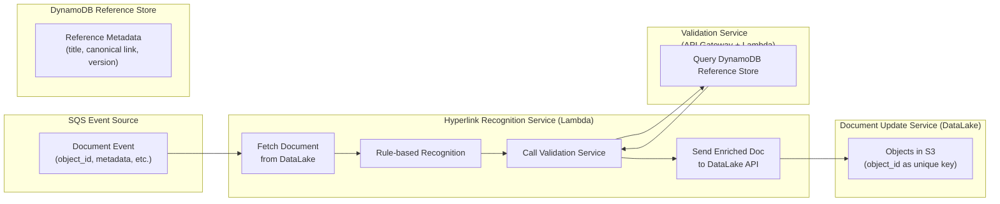
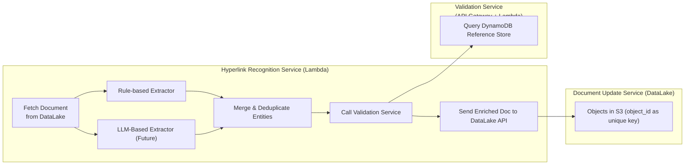

# Hyperlink Recognition Overview

In legal documents, academic papers, and business reports, it is common to reference external documents, cases, or data sources.

The Hyperlink Recognition feature provides an automated mechanism to detect such references, verify their validity, and convert them into interactive hyperlinks—enhancing both document connectivity and usability.

## Core Capabilities

- **Rule-Based Detection**

    Identify potential references through configurable patterns such as special symbols, predefined keywords, and regular expressions.

- **Automated Validation**

    Integrate with validation services to ensure referenced targets exist and are accessible.

- **Intelligent Transformation**

    Convert verified references into interactive hyperlinks while preserving the original document format and readability.

## Design Principles

- **Configurable Rule Engine**

    Supports custom recognition patterns, adaptable to different document types and use cases.

- **Extensible Validation Services**

    Validation interfaces are pluggable and can support various types of references (e.g., legal codes, case numbers, standards, data sources).

- **Format-Neutral Output**
  
  Designed to integrate seamlessly with diverse document processing and publishing workflows.

## Typical Use Cases

- Referencing standards in technical documentation
- Linking statutes and case law in legal documents
- Citing sources in academic papers
- Embedding data references in business reports
- Any scenario requiring conversion of plain-text references into actionable hyperlinks

## Value Proposition

- **Improved Interactivity**

    Enables readers to navigate directly to referenced content.

- **Increased Accuracy**

    Ensures references are valid, current, and uniquely identified.

- **Operational Efficiency**

    Reduces manual effort in curating references and improves overall productivity.

## Technology Stack

- Programming Languages: Java, Python
- Infrastructure: AWS Lambda, API Gateway, DynamoDB
- Other: Open-source libraries and frameworks can be integrated as needed

## System Architecture

The Hyperlink Recognition system is designed to automatically detect and validate references within documents (e.g., laws, academic citations, standards) and enrich them with hyperlinks. The system must:

- Process incoming documents asynchronously.
- Support scalable validation of references against an authoritative store.
- Update enriched documents back into the storage system with version control.

We design the system with five major components:

1. SQS Event Source
    - Provides asynchronous triggering for the Recognition Service.
    - Each event contains document metadata such as: 
      - `object_url,object-id, object-collection-id, object-catalog-id, content-length, version, version-timestamp, owner`

2. Hyperlink Recognition Service (AWS Lambda)
   - Fetches the document from DataLake(A storage service based-on AWS S3) using the event metadata.
   - Applies rule-based recognition to extract potential references.
   - Invokes the Validation Service to confirm reference validity.
   - Sends enriched document back to DataLake API for update.

3. Validation Service (API Gateway + Lambda)
    - Exposes a RESTful API for reference validation.
    - Queries DynamoDB Reference Store for authoritative mappings:
        - e.g., title → canonical link, case_no → canonical link.
    - Returns validated link metadata to the Recognition Service.

4. DynamoDB Reference Store
    - Stores reference metadata (title, canonical link, version, etc.).
    - Ensures references can be validated, normalized, and uniquely resolved.
    - Supports fast, scalable lookup by Validation Service.

6. Document Update Service(DataLake)
   - A storage service built on AWS S3.
   - Handles versioning, metadata, and persistence into the underlying S3 storage automatically.
   - Uses objects as the fundamental storage unit.
   - Each object is uniquely identified by an object-id within its collection in DataLake.
   - The DataLake API is exposed as an external service for document retrieval and update, abstracting the underlying S3 operations.

## Future Improvements / Advanced Extraction (MCP / LLM)

**Goal:** Enhance the Hyperlink Recognition system by incorporating large language model (LLM) capabilities for complex or ambiguous references that are difficult to capture with rule-based extractors alone.

**Planned Approach:**

- **LLM-Based Extractor (MCP Service)**
  - Design a microservice to handle ambiguous or context-heavy text segments.
  - Use pretrained LLMs (e.g., ChatGPT, DeepSeek) to identify potential references and their attributes.
  - Return results in a standardized entity format, consistent with rule-based extractors.

- **Integration with Rule-Based Extractors**
  - Provide a unified interface in the Hyperlink Recognition Service to merge entities extracted by rules and LLM.
  - Implement confidence scoring or prioritization: e.g., use rule-based results when high-confidence, LLM for low-confidence/ambiguous cases.

- **Potential Benefits**
  - Capture references that are missed by static rules.
  - Handle natural language variations and document-specific abbreviations.
  - Enable continuous improvement by retraining or fine-tuning the LLM using feedback from the validation service.

- **Implementation Considerations**
  - Define clear API for the LLM extractor service, with input as text segments and output as structured Entity objects.
  - Ensure asynchronous or batch processing to maintain system scalability.
  - Logging, auditing, and monitoring for LLM outputs to allow validation and quality control.

