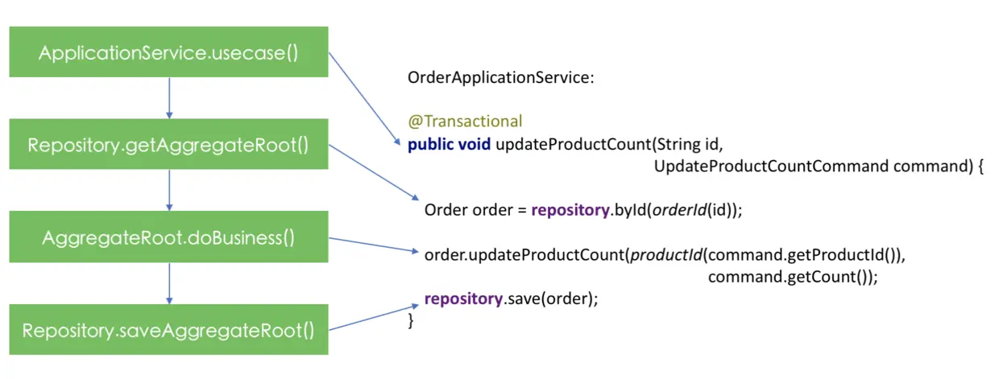

# Architecture Decision Records (ADR)

- 《实现领域驱动设计》
- 《架构整洁之道》

## Domain-Driven Design (DDD)

This project follows Domain-Driven Design principles to create a maintainable and scalable vocabulary management system.

### Core Concepts

- **Bounded Context**: The vocabulary domain is isolated from other domains
- **Aggregate Root**: `Vocabulary` entity serves as the aggregate root
- **Repository**: `VocabularyRepository` interface defines the persistence contract
- **Application Services**: Controllers handle HTTP requests and coordinate domain operations

### Project Structure