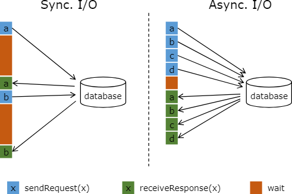

# Flink Async Function

## References
- [Flink Async I/O](https://nightlies.apache.org/flink/flink-docs-master/docs/dev/datastream/operators/asyncio/)

## What is the purpose of the project? 

- How to use the Async Function provided by Flink?
- How is the Async Function implemented with retry and timeout semantics?
- How to implement an asynchronous HTTP sink function in Flink using the Async Function and Apache HttpClient.

## Async Function 

Sync I/O vs Async I/O:

Async Function interfaces:

- AsyncFunction
- RichAsyncFunction

