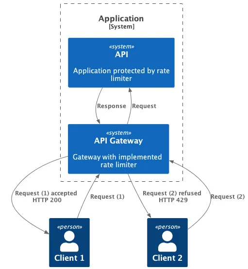

# Rate Limiter

## References

- [SystemDesign: Distributed API Rate Limiter](https://systemsdesign.cloud/SystemDesign/RateLimiter)
- [Google-architecture: Rate-limiting strategies and techniques](https://cloud.google.com/architecture/rate-limiting-strategies-techniques)
- [Cloudflare: What is rate limiting?](https://www.cloudflare.com/learning/bots/what-is-rate-limiting/)
- [Cloudflare: How we built rate limiting capable of scaling to millions of domains](https://blog.cloudflare.com/counting-things-a-lot-of-different-things/)
- [NGINX Rate Limiting](https://www.nginx.com/blog/rate-limiting-nginx/)
- [Guava Rate Limiter](https://github.com/google/guava/blob/master/guava/src/com/google/common/util/concurrent/RateLimiter.java)
- [Guava Rate Limiter Test](https://github.com/google/guava/blob/master/guava-tests/test/com/google/common/util/concurrent/RateLimiterTest.java)
- [Quick Guide to the Guava RateLimiter](https://www.baeldung.com/guava-rate-limiter)

## What is Rate Limiting?

Rate limiting are a way to limit the number of requests that can be made to a specific endpoint. This is useful for preventing abuse of your API. For example, you may want to limit the number of requests that can be made to your endpoint to prevent brute force attacks. They also prevent resource starvation by limiting the number of requests that can be made to a specific endpoint. 

An API that utilizes rate limiting may throttle clients that attempt to make too many calls or temporarily block them altogether. Users who have been throttled may either have their requests denied or slowed down for a set time. This will allow legitimate requests to still be fulfilled without slowing down the entire application.

API responses with HTTP Status Code **429 Too Many Requests** when a request is rate limited or throttled.

## Rate Limiting vs Throttling

Rate Limiting is a process that is used to define the rate and speed at which consumers can access APIs. Throttling is the process of controlling the usage of the APIs by customers during a given period. Throttling can be defined at the application level and/or API level. When a throttle limit is crossed, the server returns HTTP status "429 - Too many requests".

## Where to put the Rate Limiter ?

1. **Server side**: This is the least common type of rate limiters. Server side rate limiters are more effective than client side rate limiters. They can not be bypassed by using multiple clients. They also protect the server from malicious users.
2. **Client side**: This is the most common type of rate limiter. Client side rate limiters are easy to implement, but they are not very effective. Malicious actor can change client-side code and bypass rate limiter.

3. **Proxy**: There is third and much better option to implement rate limiter as middleware. 

    **Client -> API Gateway(Gateway with Implemented rate limiter) -> Server**.

## Common Rate Limiting Algorithms

- Token Bucket algorithm
- Leaky Bucket algorithm
- Fixed Window Counter algorithm
- Sliding Window Logs algorithm
- Sliding Window Counter algorithm
